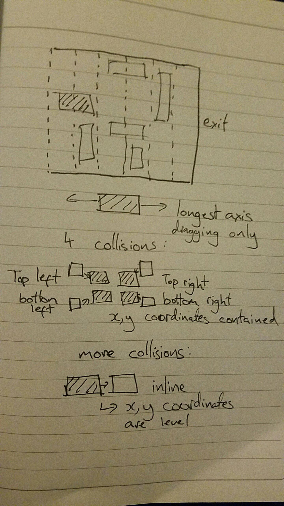

# Sparta-Core-Project-1
JavaScript UNBLOCK ME Game

## The Task
* create a browser game using the methods we've learnt over the past two weeks
* incorporate agile practices
* the project will be developed over github
* user stories progress tracked using trello

## My Game
I designed my very own version of KIRA GAMES' Unblock Me, a spacial block sliding puzzle.

## Instructions
1. The aim of the game is to get your red block to the edge of the right hand side in as few moves as possible.
2. You will need to move the other blocks out the way to complete the puzzle.
3. Blocks are moved by clicking and dragging.
4. Blocks cannot be moved through each other.

## Implementation
* jQuery
* HTML5
* CSS3
* a lot of Maths and visualisation!

## Sprint 1
Within sprint one I managed to complete user story features with ease with help from jQuery UI's draggable plugin. However towards the end of sprint one I realised there were limitations with this library

 being unable to deliver a fully completed Minimal Viable Product with this plugin I built this games from the ground up myself in sprint two.

 ## Sprint 2
 main achievements:
 1. building a collision detection engine
 2. making the blocks draggable
 3. implementing music
 4. dynamically building each level using objects

## I am most pleased with
The working collision detection engine, and the way I designed the levels using objects. The latter means that it would be very simple to make a 'level builder' game mode, taking dimensions and initial positions and turning them into blocks.

## My biggest challenges
coming up with the logic behind the collision detection engine, visualising the true conditions of collisions.

## Things I would change
1. I would create the level builder mode.
2. I would look further into mouse position capture, so that could be used for more accurate block dragging.
3. I would not try to use depreciated plugins - or at least not make them a key component of my project.
4. the winner modal alert.

## Planning
My [trello](https://trello.com/b/voAuv1Pc/sparta-core-project1) board, all the user stories were essentially completed twice due to restarting midway.

